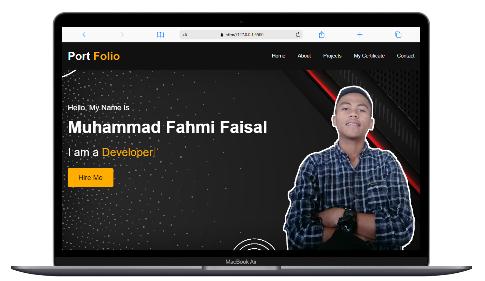

Tentu! Ini contoh file `README.md` GitHub yang rapi dan profesional untuk project portfolio HTML kamu:

---

# Personal Portfolio Website

Welcome to my **Personal Portfolio Website** repository!  
This project showcases my profile, projects, certificates, and contact information in a clean and responsive single-page design.

## 🖼️ Preview

 <!-- (Opsional: upload screenshot di repo dan ubah nama file previewnya) -->

## ✨ Features

- Responsive Navigation Bar
- Interactive Home Section
- About Me Section with detailed bio
- Showcase of Projects
- Certificates Display
- Contact Form with FormSubmit integration
- Social Media Links
- Smooth scrolling and modern UI design

## 📄 Technologies Used

- **HTML5**
- **CSS3**
- **JavaScript** (basic interaction)
- **Font Awesome** (for icons)
- **FormSubmit** (for handling contact form)

## 📚 Sections Overview

| Section       | Description |
| -------------- | ----------- |
| Home           | Welcome page introducing my name and profession |
| About          | My academic background, interests, and career goals |
| Projects       | Portfolio of past projects |
| Certificates   | Certifications and achievements |
| Contact        | Contact form and social media links |

## 🚀 Getting Started

1. Clone the repository:

   ```bash
   git clone https://github.com/yourusername/portfolio-website.git
   ```

2. Navigate into the project folder:

   ```bash
   cd portfolio-website
   ```

3. Open `index.html` in your favorite browser.

## 🛠️ Project Structure

```
portfolio-website/
├── images/
│   ├── about-me.jpg
│   ├── project-1.png
│   ├── project-2.png
│   ├── project-3.png
│   ├── sertif-1.jpg
│   ├── sertif-2.jpg
│   └── sertif-3.jpg
├── style.css
├── script.js
└── index.html
```

## 📬 Contact

If you want to collaborate or have any questions, feel free to reach out!

- 📧 Email: muhammadfahmifaisal014@gmail.com
- 🔗 [LinkedIn](https://www.linkedin.com/in/muhammad-fahmi-faisal-0b308b347)
- 📷 [Instagram](https://www.instagram.com/muhammadfahmifaisal_014)
- ▶️ [YouTube](https://youtube.com/@santriputrappnh)
- 📘 [Facebook](https://www.facebook.com/share/1APmRbyung/)

---

© 2025 Muhammad Fahmi Faisal

---

Kalau kamu mau, saya juga bisa sekalian buatkan *badge GitHub* seperti "Website Live", "License", atau "Made with ❤️" untuk mempercantik README ini.  
Mau sekalian dibuatkan juga? 🚀
